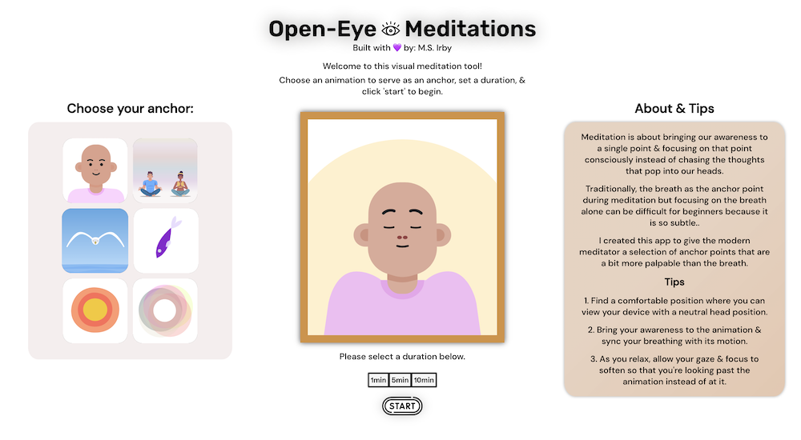

Open-Eye Meditations

## Link to App

https://msinclair.dev/visual-meditation-app/

## Description

Meditation is about bringing our awareness to a single point & focusing on that point consciously instead of chasing the thoughts that pop into our heads.

Traditionally, the breath as the anchor point during meditation but focusing on the breath alone can be difficult for beginners because it is so subtle.

I created this app to give the modern meditator a selection of anchor points that are a bit more palpable than the breath.

The basic functionality of the app is as follows:
 - users can choose from 6 animations to serve as the anchor or focus point of their meditation
 - users can choose between a 1min, 5min, or 10min meditation duration
 - users are provided visual feedback from the animation and other UI elements as guidance through their meditation

 The app was built using React and [Lottiefiles](https://lottiefiles.com/) animation JSON which is rendered by the [react-lottie-player](https://www.npmjs.com/package/react-lottie-player). 

## Images

App Landing Page

## Tech Stack
    - React.js
    - Javascript
    - CSS 
    - HTML 

## Notable Packages/Libraries
    - react-lottie-player
    - gh-pages

## Planned Features
- Add ability for the user to change the length of breaths by manipulating animation frame rate and duration
- Audio breath feedback cues

